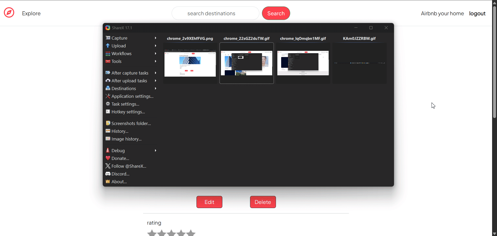
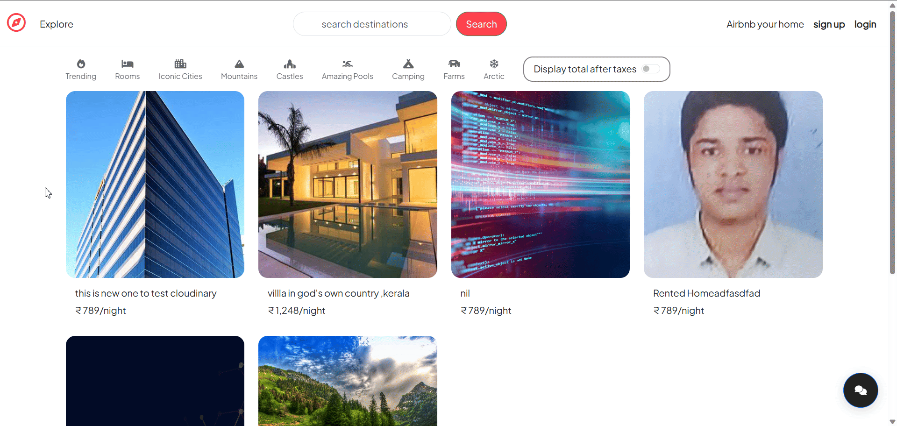

# 🌍 Wanderlust - CONVERSATIONAL AIRBNB

A server‑side rendered Node.js application inspired by Airbnb, enabling users to list, browse, and manage properties—complete with an Multi-Agentic chat bot for automatic clicks !


## 🔥 Features

- **Listings CRUD**  
  User are able create, read, update, and delete property listings and they can coment on the listings , can give ratings for the listing.
  
- **Conversational Chat Bot**  
  A MULTI-AGENT system (built with `@openai/agent  sdk`) that lets you log in/out or manage listings simply by talking—no clicks required.
  Build Agents such as Login Agent, Logout Agent , Create Listing Agent , Update Listing Agent , Delete Listing Agent and one and only TRIAGE AGENT helps for routing 
  to the user needs.
  

- **User Authentication**  
  Sign up, log in, log out (Passport.js + MongoDB sessions).
  

- **Interactive Maps**  
  Each listing displays its location via Mapbox.


### Installation

```bash
# 1. Clone the repo
git clone https://github.com/<your‑username>/wanderlust.git
cd wanderlust

# 2. Install dependencies
npm install

# 3.run the project 
node app.js
